<p align="center">
  
</p>

<h1 align="center">🌾 Awesome Agricultural Biotech AI Specialist Interview Q&A 🧬</h1>

<p align="center">
  <a href="#-topic-breakdown"></a>
  <a href="#-repository-structure"></a>
  <a href="LICENSE"></a>
  <a href="CONTRIBUTING.md"></a>
</p>

<p align="center">
  <em>🌍 A comprehensive, community-curated collection of <strong>185+ interview questions and answers</strong> for <strong>Agricultural Biotech AI Specialist</strong> roles — professionals who apply machine learning and computational biology to crop genomics, plant breeding, precision agriculture, and agricultural biotechnology product development.</em>
</p>

<p align="center">
  🧪 Plant Genomics &nbsp;·&nbsp; 🤖 Applied ML &nbsp;·&nbsp; 🛰️ Remote Sensing &nbsp;·&nbsp; 🌱 Agronomy
</p>

---

## 📌 Overview

**Agricultural Biotech AI Specialists** 🔬 build and deploy computational/ML systems across the agricultural biotech value chain — genomic selection for crop breeding 🌾, gene editing target discovery (e.g., CRISPR trait engineering ✂️), phenotyping from imaging/remote sensing data 📸, yield and environmental stress prediction 📈, and decision-support tools for growers 👨‍🌾 — while navigating the unique constraints of agricultural biological systems (multi-year breeding cycles ⏳, genotype-by-environment interactions 🌦️, field-scale variability 🗺️) and agbiotech regulatory pathways (USDA/EPA/FDA coordinated framework 📋).

### 📦 This repository covers:

- 🧬 Plant genomics and breeding fundamentals for ML practitioners
- 📊 Genomic selection and prediction modeling
- ✂️ Gene editing target discovery and CRISPR trait engineering AI
- 📸 Phenomics, remote sensing, and computer vision for agriculture
- 🌦️ Genotype-by-environment (G×E) modeling and multi-environment trials
- 🚜 Precision agriculture and decision-support systems
- 📋 Agbiotech regulatory pathways (USDA-APHIS, EPA, FDA coordinated framework)
- 🗄️ Data infrastructure, field trial design, and industry landscape

> [!TIP]
> ⏱️ **Estimated preparation time:** 30–50 hours
> 🎤 **Interview duration:** Typically 4–6 rounds (3–5 hours total), often including a modeling case study and a genomics/agronomy domain round

---

## 🗂️ Repository Structure

```
📁 Awesome-Agricultural-Biotech-AI-Specialist-Interview-QA/
├── 📄 README.md
├── 🤝 CONTRIBUTING.md
├── ⚖️  LICENSE
├── 🖼️  assets/
│   └── 🎨 banner.svg
├── 📚 topics/
│   ├── 🧬 01-Plant-Genomics-Breeding-Fundamentals.md
│   ├── 📊 02-Genomic-Selection-Prediction-Modeling.md
│   ├── ✂️  03-Gene-Editing-Target-Discovery.md
│   ├── 📸 04-Phenomics-Remote-Sensing-Computer-Vision.md
│   ├── 🌦️  05-GxE-Multi-Environment-Trial-Modeling.md
│   ├── 🚜 06-Precision-Agriculture-Decision-Support.md
│   ├── 🗄️  07-Data-Infrastructure-Field-Trial-Design.md
│   ├── ✅ 08-Model-Validation-Deployment.md
│   ├── 📋 09-Regulatory-Coordinated-Framework.md
│   ├── 🤝 10-Cross-Functional-Collaboration.md
│   ├── 🔧 11-Troubleshooting-Case-Studies.md
│   └── 🌍 12-Industry-Context-Sustainability.md
├── 📖 docs/
│   ├── 📝 glossary.md
│   ├── 🔗 resources.md
│   └── 🗺️  roadmap.md
└── 🚫 .gitignore
```

---

## 🎯 Topic Breakdown

| # | 📖 Topic | 🔍 Focus Area | 📝 Q&A Count |
|:---:|:---------|:-------------|:------------:|
| 01 | 🧬 Plant Genomics & Breeding Fundamentals | Ploidy, heterosis, breeding schemes, QTLs | **16** |
| 02 | 📊 Genomic Selection & Prediction Modeling | GBLUP, genomic prediction accuracy, marker effects | **16** |
| 03 | ✂️ Gene Editing Target Discovery | CRISPR design, off-target prediction, trait engineering | **15** |
| 04 | 📸 Phenomics, Remote Sensing & Computer Vision | Drone/satellite imagery, high-throughput phenotyping | **16** |
| 05 | 🌦️ GxE & Multi-Environment Trial Modeling | Genotype-environment interaction, envirotyping | **15** |
| 06 | 🚜 Precision Agriculture & Decision Support | Variable rate application, grower-facing tools | **15** |
| 07 | 🗄️ Data Infrastructure & Field Trial Design | Experimental design, data pipelines, spatial statistics | **15** |
| 08 | ✅ Model Validation & Deployment | Cross-validation across environments/years, deployment | **14** |
| 09 | 📋 Regulatory Coordinated Framework | USDA-APHIS, EPA, FDA, international biosafety | **15** |
| 10 | 🤝 Cross-Functional Collaboration | Working with breeders, agronomists, field teams | **14** |
| 11 | 🔧 Troubleshooting & Case Studies | Model failures, data quality issues, field diagnostics | **14** |
| 12 | 🌍 Industry Context & Sustainability | Market landscape, climate resilience, food security | **14** |
| | 🏆 **TOTAL** | | **179** |

---

## 🚀 How to Use This Repository

### 📅 Study Plan (6 Weeks)

| 📆 Week | 📚 Topics | 🎯 Focus |
|:-------:|:---------|:---------|
| **Week 1** | Topics 01–02 | 🧬 Plant Genomics Fundamentals + 📊 Genomic Selection |
| **Week 2** | Topics 03–04 | ✂️ Gene Editing + 📸 Phenomics/Computer Vision |
| **Week 3** | Topics 05–06 | 🌦️ GxE Modeling + 🚜 Precision Agriculture |
| **Week 4** | Topics 07–08 | 🗄️ Data Infrastructure + ✅ Model Validation |
| **Week 5** | Topics 09–10 | 📋 Regulatory + 🤝 Cross-Functional Collaboration |
| **Week 6** | Topics 11–12 | 🔧 Troubleshooting + 🌍 Industry Context + 🎤 Mock Interviews + 🔄 Review |

> [!IMPORTANT]
> 💡 Dedicate **5–8 hours per week** for optimal retention. Combine reading with hands-on practice on real genomic/agricultural datasets!

---

## 📖 Quick Start Example

**From Topic 05: 🌦️ GxE & Multi-Environment Trial Modeling**

> 💬 **Q: A genomic prediction model trained on multi-environment trial data from the Midwest US shows a substantial accuracy drop when applied to a breeding program's newly expanded trial sites in a different agroecological zone. How do you diagnose and address this?**
>
> 🧠 **A:** This is a classic genotype-by-environment interaction generalization failure — the model likely learned marker-trait associations that are partially environment-specific (e.g., alleles conferring an advantage under the Midwest's specific temperature/photoperiod/soil conditions) rather than purely additive, environment-independent genetic effects, and these associations don't transfer to a meaningfully different agroecological zone. Diagnosis starts with envirotyping the new sites 🌡️ (characterizing their climate/soil covariates) to quantify how different they actually are from the training environments, followed by checking whether prediction accuracy correlates with environmental distance from the training set 📉. The fix typically isn't simply more data from the original zone, but rather incorporating explicit environmental covariates into a genomic-by-environment prediction model 🔧 (e.g., a reaction-norm or environmental-covariate-enabled genomic prediction framework) and, ideally, collecting at least limited multi-year trial data from the new zone to recalibrate environment-specific effects rather than assuming the original model generalizes. 🔄

---

## 🤝 Contributing

See **[CONTRIBUTING.md](CONTRIBUTING.md)** for guidelines. 📜

**🌟 Areas seeking contributions:**

- 🧠 Genomic prediction deep learning architecture case studies (vs. traditional GBLUP/Bayesian methods)
- 📝 Gene-edited crop regulatory case studies as USDA-APHIS biotechnology rules evolve
- 🌡️ Climate-resilience trait modeling (drought, heat stress) deep dives
- 🔄 De-identified field trial data pipeline / model deployment case studies

> [!NOTE]
> 🙌 All contributions are welcome! Whether you're a plant breeder, ML engineer, or agronomist — your expertise matters.

---

## ⚖️ License

MIT License — see **[LICENSE](LICENSE)**. 📄

---

<p align="center">
  <strong>📅 Last Updated:</strong> July 2026 &nbsp;|&nbsp; <strong>👥 Contributors:</strong> 1 (growing! 🌱)
</p>

<p align="center">
  <em>⭐ If you find this resource helpful, please consider giving it a star!</em>
</p>

<p align="center">
  🌾🧬🤖🌍
</p>
